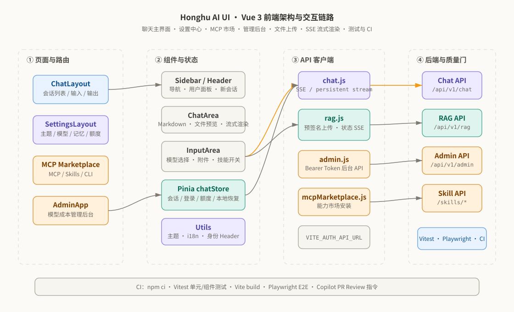

<div align="center">

# 🦅 Honghu AI · Web 前端

### 现代 AI 对话工作台 — 流式聊天 · RAG 知识库 · 技能广场 · 计费看板 · 管理后台

[](https://github.com/shilaoban666/Honghu-ai-assigmemt-UI/actions/workflows/ci.yml)
[](https://vuejs.org/)
[](https://vitejs.dev/)
[](https://pinia.vuejs.org/)
[](https://tailwindcss.com/)
[](https://echarts.apache.org/)
[](#-测试)

**SSE 流式对话 · 多轮记忆 · 文件 RAG 直传 · MCP/技能市场 · 截图标注 · i18n · 角色权限 · ECharts 看板**

</div>

<p align="center">
  
</p>

---

## 🎯 项目定位

**Honghu AI UI** 是 Honghu AI 平台的前端工程。它不只是一个聊天框页面，而是围绕 AI 产品常见工作流搭建的完整 SPA：用户登录、会话管理、流式聊天、文件上传、RAG 处理状态、技能开关、MCP 市场、设置中心、用量展示和企业模型成本后台。

这个前端仓库用于配合后端项目展示完整产品交付能力：组件拆分、状态管理、接口封装、异常处理、响应式 UI、单元/组件/E2E 测试和 GitHub CI 都已经落地。

## 🧭 前端架构

<p align="center">
  
</p>

---

## 核心功能

| 模块 | 说明 |
|:---|:---|
| 💬 **流式对话** | 基于 `fetch` 的 **SSE** 逐字流式输出（`persistentStreamChat`），打字机效果；对话持久化、可回溯历史会话。 |
| 🧠 **多轮记忆** | 会话级上下文管理，自动携带历史与记忆，配合后端三层记忆。 |
| 📚 **RAG 文件知识库** | 前端直传：获取 S3 预签名 URL → `XMLHttpRequest` 带进度直传 → 登记文件 → **SSE 订阅摄取状态**，实时显示解析/向量化进度。 |
| 🧩 **技能广场** | 浏览 / 搜索 / 安装全网 **MCP / Tool-Calling / CLI / Claude Skills**，分类、健康度、免鉴权筛选，输入框下方技能胶囊实时刷新。 |
| ✂️ **截图标注** | 内置 `ScreenshotEditor`，可对上传图片做画布标注后再发送。 |
| ⚙️ **设置中心** | 四大类设置：Agent（记忆/模型/技能）、通用（外观/通知/资料/快捷键/统计）、套餐（计费/额度/用量/推荐）、系统（关于/高级/存储）。 |
| 📊 **计费 & 用量看板** | 基于 **ECharts** 的额度、用量、成本可视化（token + 金额双口径）。 |
| 🛡️ **独立管理后台** | 独立挂载的 `AdminApp`：用户 / 模型 / 角色配额 / 工作空间 / 套餐 / 用量审计 / RAG 概览，Bearer Token 鉴权、401/403 自动登出。 |
| 🌐 **i18n & 主题** | 多语言文案与可切换主题，单测覆盖。 |
| 🔐 **角色权限** | Guest / User / VIP / Admin，前端按身份头（`X-User-Id` / `X-Workspace-Id`）携带可信上下文。 |

---

## 技术栈

| 分类 | 技术选型 |
|:---|:---|
| 框架 | Vue 3 · Vue Router 4 · Composition API |
| 构建 | Vite 5 · Rollup manualChunks |
| 状态 | Pinia · localStorage 恢复 |
| 样式 | Tailwind CSS · CSS Variables · 多主题 |
| 图表 | ECharts 6 |
| 网络 | Axios · Fetch Stream · XMLHttpRequest 上传进度 |
| 测试 | Vitest · Vue Test Utils · jsdom · Playwright |
| 工程化 | npm scripts · GitHub Actions · Copilot Review 指令 |

## 🚀 快速启动

```bash
git clone https://github.com/shilaoban666/Honghu-ai-assigmemt-UI.git
cd Honghu-ai-assigmemt-UI

npm ci
cp .env.example .env
npm run dev
```

默认开发地址：

| 服务 | 地址 |
|:---|:---|
| 🌐 前端开发服务 | http://localhost:5174 |
| 🔌 后端 API | http://localhost:8080/api/v1 |
| 🛡️ 后台 API | http://localhost:8080/api/v1/admin |

`.env` 示例：

```env
VITE_AUTH_API_URL=http://localhost:8080/api/v1
```

> `vite.config.js` 当前开发端口为 `5174`。如果后端使用默认 `8080`，建议通过 `VITE_AUTH_API_URL` 直连后端。

## 🗂️ 项目结构

```text
Honghu-ai-assigmemt-UI/
├── src/
│   ├── api/                    # chat / auth / rag / admin / identity / mcp marketplace
│   ├── components/             # 聊天、输入、侧边栏、登录、弹窗、文件预览等组件
│   ├── components/settings/    # 设置页通用组件
│   ├── layouts/                # ChatLayout 主聊天壳
│   ├── router/                 # Vue Router 配置
│   ├── stores/                 # Pinia chatStore
│   ├── utils/                  # 主题、i18n、历史消息归一化
│   ├── views/
│   │   ├── marketplace/        # MCP 技能市场
│   │   └── settings/           # 通用 / 套餐 / 智能体 / 系统设置
│   ├── AdminApp.vue            # 企业模型成本后台
│   ├── App.vue
│   └── main.js
├── tests/
│   ├── unit/                   # store、API、主题、i18n 单测
│   ├── components/             # Vue 组件测试
│   └── e2e/                    # Playwright 主界面 E2E
├── docs/images/                # 架构图
├── .github/workflows/ci.yml
├── vite.config.js
├── vitest.config.js
├── playwright.config.js
└── package.json
```

## 🌐 API 对接

| 客户端 | 文件 | 后端路径 | 说明 |
|:---|:---|:---|:---|
| 聊天 | `src/api/chat.js` | `/api/v1/chat` | 持久化 SSE 聊天、历史消息、会话列表 |
| RAG | `src/api/rag.js` | `/api/v1/rag` | 预签名上传、文件登记、状态轮询/订阅、下载 URL |
| 登录 | `src/api/auth.js` | `/api/v1/users` | 注册、登录、用户资料 |
| 后台 | `src/api/admin.js` | `/api/v1/admin` | 模型、价格、角色、用户、工作空间、用量、Provider |
| 技能市场 | `src/api/mcpMarketplace.js` | `/api/v1/skills/mcp-marketplace` | MCP 市场查询与安装 |
| 身份头 | `src/api/identity.js` | 所有用户态 API | 注入 `X-User-Id` 与 workspace 上下文 |

## 🧪 测试

```bash
# 单元与组件测试
npm run test

# 生产构建
npm run build

# E2E 测试
npm run test:e2e

# 全量测试
npm run test:all
```

当前测试覆盖重点：

- `chatStore` 登录、恢复、会话、消息、置顶和删除逻辑
- API 身份 Header 注入与历史消息归一化
- 主题和 i18n 切换
- `ConfirmDialog` 组件交互
- 主聊天界面 Playwright smoke test

## 🚦 CI

GitHub Actions 在 push / PR 到 `master`、`dev` 时跑两个 job：

**`build`（核心质量门，必须全绿）**

1. `npm ci`
2. `npm run lint`（ESLint）
3. `npm run test`（Vitest 单元 / 组件）
4. `npm run build`
5. 上传 `dist` 产物

**`e2e`（独立 job，Playwright 浏览器走缓存）**

- `needs: build`；浏览器二进制用 `actions/cache` 缓存，命中时只补系统依赖
- `webServer` 自动起 dev server 后跑 `npm run test:e2e`，上传 report / test results
- `continue-on-error: true`：E2E 用真实浏览器有天然 flake，偶发失败不拖红整体绿标（要强制阻塞就删掉这行）

CI 文件：`.github/workflows/ci.yml`

## 🤖 Copilot PR Review

仓库已准备好 Copilot Review 的仓内配置：

- `.github/copilot-instructions.md`：告诉 Copilot 审查 Vue 前端时重点关注流式读取、文件上传状态、身份 Header、响应式 UI、可访问性、测试和构建体积。
- `.github/pull_request_template.md`：要求 PR 明确变更范围、测试结果、截图和风险。
- `.github/workflows/ci.yml`：提供真实可执行的质量门。

还需要在 GitHub 页面开启自动审查：进入仓库 **Settings → Rules → Rulesets → New ruleset**，选择目标分支后启用 **Request pull request review from Copilot**。后端仓库也需要同样配置。

官方参考：

- [Configure automatic code review by Copilot](https://docs.github.com/en/copilot/how-tos/copilot-on-github/set-up-copilot/configure-automatic-review)
- [Add repository custom instructions for GitHub Copilot](https://docs.github.com/en/copilot/how-tos/configure-custom-instructions/add-repository-instructions)

## 🗺️ Roadmap

- [ ] 基于 OpenAPI 自动生成 TypeScript API Client。
- [ ] 给 SSE 流式响应增加更细粒度的取消、重试和断点提示。
- [ ] 增加后台端到端测试和 API mock。
- [ ] 给 RAG 引用片段增加前端引用展开视图。
- [ ] 增加 Lighthouse / bundle size budget 检查。

---

<div align="center">

**🦅 Honghu AI UI** — 把一套真实可用的 LLM 应用平台，完整地工程化落地。

</div>
