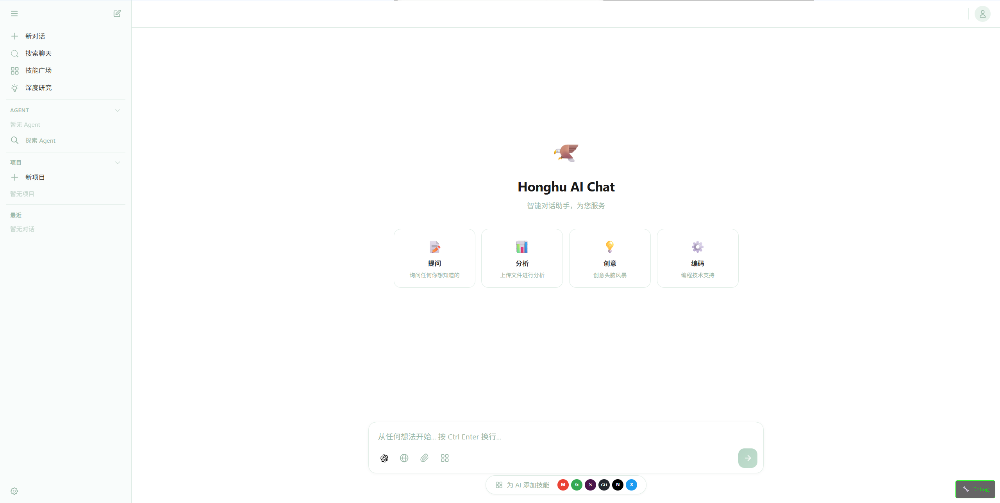
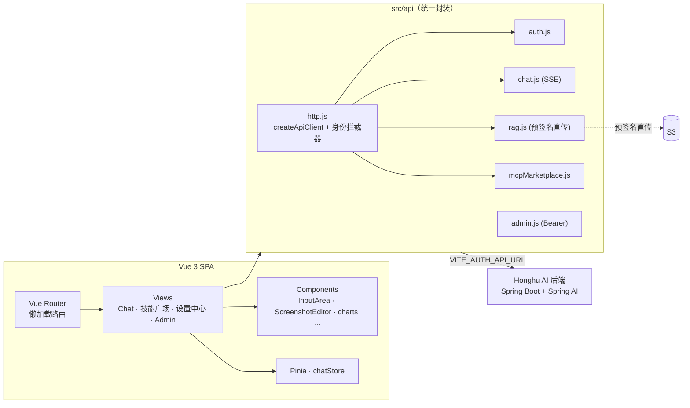

<div align="center">

# 🦅 Honghu AI · Web 前端

### 现代 AI 对话工作台 — 流式聊天 · RAG 知识库 · 技能广场 · 计费看板 · 管理后台

[](https://github.com/shilaoban666/Honghu-ai-assigmemt-UI/actions/workflows/ci.yml)
[](https://vuejs.org/)
[](https://vitejs.dev/)
[](https://pinia.vuejs.org/)
[](https://tailwindcss.com/)
[](https://echarts.apache.org/)
[](#-测试)

**SSE 流式对话 · 多轮记忆 · 文件 RAG 直传 · MCP/技能市场 · 截图标注 · i18n · 角色权限 · ECharts 看板**

</div>

<p align="center">
  
</p>

> 本仓库是 **Honghu AI** 平台的 Web 前端（Vue 3 单页应用）。后端（Spring Boot 3 + Spring AI + RAG + 技能系统）见 👉 [Honghu-ai-assigmemt](https://github.com/shilaoban666/Honghu-ai-assigmemt)。

---

## 目录

- [核心功能](#核心功能)
- [技术栈](#技术栈)
- [系统架构](#系统架构)
- [快速开始](#快速开始)
- [可用脚本](#可用脚本)
- [环境变量](#环境变量)
- [项目结构](#项目结构)
- [测试](#-测试)
- [工程化](#工程化)

---

## 核心功能

| 模块 | 说明 |
|:---|:---|
| 💬 **流式对话** | 基于 `fetch` 的 **SSE** 逐字流式输出（`persistentStreamChat`），打字机效果；对话持久化、可回溯历史会话。 |
| 🧠 **多轮记忆** | 会话级上下文管理，自动携带历史与记忆，配合后端三层记忆。 |
| 📚 **RAG 文件知识库** | 前端直传：获取 S3 预签名 URL → `XMLHttpRequest` 带进度直传 → 登记文件 → **SSE 订阅摄取状态**，实时显示解析/向量化进度。 |
| 🧩 **技能广场** | 浏览 / 搜索 / 安装全网 **MCP / Tool-Calling / CLI / Claude Skills**，分类、健康度、免鉴权筛选，输入框下方技能胶囊实时刷新。 |
| ✂️ **截图标注** | 内置 `ScreenshotEditor`，可对上传图片做画布标注后再发送。 |
| ⚙️ **设置中心** | 四大类设置：Agent（记忆/模型/技能）、通用（外观/通知/资料/快捷键/统计）、套餐（计费/额度/用量/推荐）、系统（关于/高级/存储）。 |
| 📊 **计费 & 用量看板** | 基于 **ECharts** 的额度、用量、成本可视化（token + 金额双口径）。 |
| 🛡️ **独立管理后台** | 独立挂载的 `AdminApp`：用户 / 模型 / 角色配额 / 工作空间 / 套餐 / 用量审计 / RAG 概览，Bearer Token 鉴权、401/403 自动登出。 |
| 🌐 **i18n & 主题** | 多语言文案与可切换主题，单测覆盖。 |
| 🔐 **角色权限** | Guest / User / VIP / Admin，前端按身份头（`X-User-Id` / `X-Workspace-Id`）携带可信上下文。 |

---

## 技术栈

| 分类 | 选型 |
|:---|:---|
| **框架** | Vue 3（Composition API + `<script setup>`） |
| **构建** | Vite 5（路由级懒加载代码分割） |
| **状态 / 路由** | Pinia · Vue Router 4 |
| **样式** | Tailwind CSS 3 · PostCSS · Autoprefixer |
| **可视化 / 图标** | Apache ECharts 6 · @lucide/vue |
| **网络** | Axios（统一 client + 身份拦截器）· 原生 `fetch`（SSE） |
| **测试** | Vitest · @vue/test-utils · jsdom · Playwright（E2E） |
| **质量** | ESLint 9（flat config）· Prettier · GitHub Actions CI |

---

## 系统架构



> 技能系统设计图见 [`docs/capability-system/`](docs/capability-system/)（含 overview / 数据模型 / 市场流程 / 运行时边界等 9 张图）。

---

## 快速开始

```bash
# 1. 安装依赖
npm install

# 2. 配置后端地址
cp .env.example .env
#   编辑 .env：VITE_AUTH_API_URL=http://localhost:8080/api/v1（或你的后端地址）

# 3. 启动开发服务器
npm run dev          # 默认 http://localhost:5173

# 4. 生产构建
npm run build        # 产物输出到 dist/
npm run preview      # 本地预览生产包
```

> 需要配合 [Honghu AI 后端](https://github.com/shilaoban666/Honghu-ai-assigmemt) 一起运行才能体验完整对话/RAG/技能功能。后端可用其 `docker compose up` 一键拉起。

---

## 可用脚本

| 命令 | 说明 |
|:---|:---|
| `npm run dev` | 启动 Vite 开发服务器（热更新） |
| `npm run build` | 生产构建 |
| `npm run preview` | 预览生产构建 |
| `npm run test` | 运行 Vitest 单元/组件测试 |
| `npm run test:coverage` | 覆盖率报告 |
| `npm run test:e2e` | 运行 Playwright 端到端测试 |
| `npm run lint` | ESLint 检查 |
| `npm run lint:fix` | ESLint 自动修复 |
| `npm run format` | Prettier 格式化 `src/` |

---

## 环境变量

| 变量 | 必填 | 说明 |
|:---|:---:|:---|
| `VITE_AUTH_API_URL` | ✅ | 后端 API 基础地址，如 `http://localhost:8080/api/v1`。生产部署改为真实地址。 |
| `VITE_ADMIN_API_URL` | ⬜ | 后台 API 地址；缺省 = `VITE_AUTH_API_URL` + `/admin`。 |

所有 API 模块统一从 `src/api/http.js` 读取基础地址，单点维护、避免漂移。

---

## 项目结构

```
src/
├── api/                 # 接口层
│   ├── http.js          #   统一 axios 工厂 + 身份拦截器（单点 base URL）
│   ├── identity.js      #   X-User-Id / X-Workspace-Id 身份头
│   ├── auth.js          #   登录 / 注册 / 资料 / 头像 / 额度
│   ├── chat.js          #   SSE 流式聊天 + 会话 / 历史
│   ├── rag.js           #   预签名直传 + 摄取状态 SSE 订阅
│   ├── mcpMarketplace.js#   技能广场 / 安装
│   └── admin.js         #   后台（Bearer Token + 错误归一化）
├── views/               # 18 个页面：Chat / 技能广场 / 设置中心(4类) / Admin
├── components/          # 21 个组件：InputArea / ScreenshotEditor / charts / settings …
├── layouts/             # ChatLayout 等布局
├── stores/              # Pinia（chatStore）
├── router/              # 路由（懒加载分块）
├── utils/ · data/ · ico/ # 工具 / 静态数据 / 图标
└── main.js / AdminApp.* # 前台入口 + 独立后台入口
```

---

## 🧪 测试

```bash
npm run test        # 63 个单元/组件测试（Vitest + @vue/test-utils）
npm run test:e2e    # Playwright 端到端
```

覆盖范围：聊天历史、身份头注入、聊天 API、chatStore（含异常 JSON 容错）、i18n、主题、ConfirmDialog 组件等。**CI 在每次 push / PR 自动跑 lint + 单测 + 构建。**

---

## 工程化

- **统一接口层**：`http.js` 提供 `createApiClient()` 工厂 + 身份拦截器，前台模块零重复；后台 `admin.js` 因鉴权不同独立维护。
- **代码分割**：路由与后台、ECharts 按需分块（`ChatLayout` / `AdminApp` / `McpMarketplaceView` 独立 chunk），首屏更轻。
- **环境驱动**：API 地址全部走环境变量，无硬编码，方便多环境部署。
- **质量门禁**：ESLint 9 flat config + Prettier + GitHub Actions CI（lint → test → build）。

---

<div align="center">

**Honghu AI Web** — 配套后端见 [Honghu-ai-assigmemt](https://github.com/shilaoban666/Honghu-ai-assigmemt)

</div>
