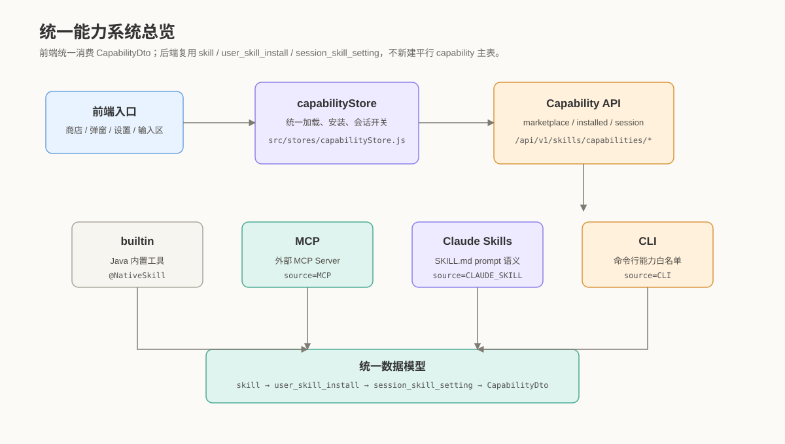
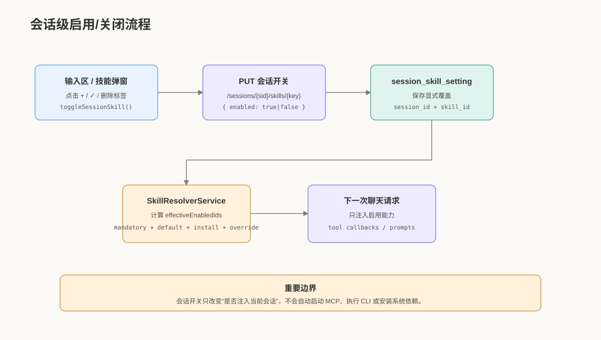
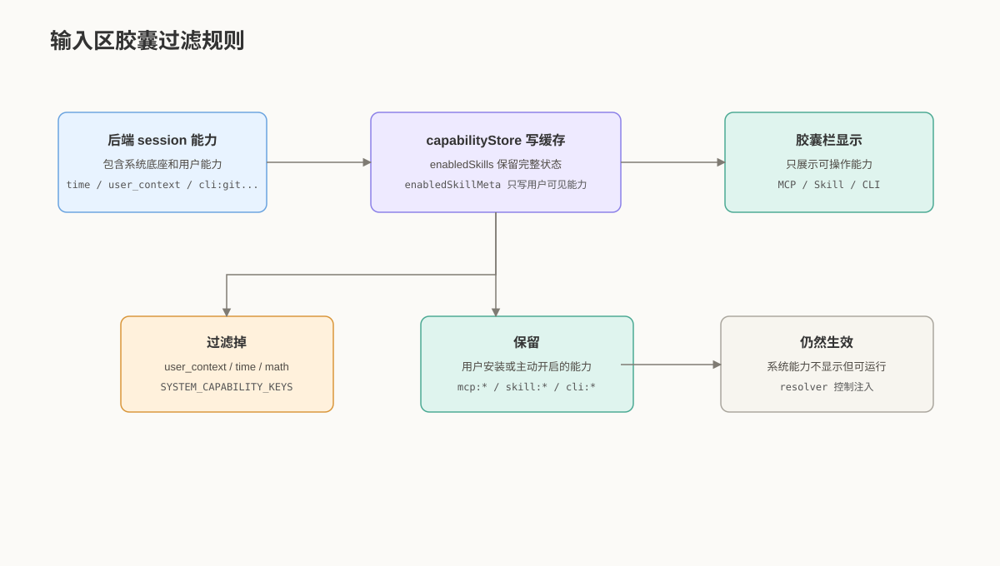
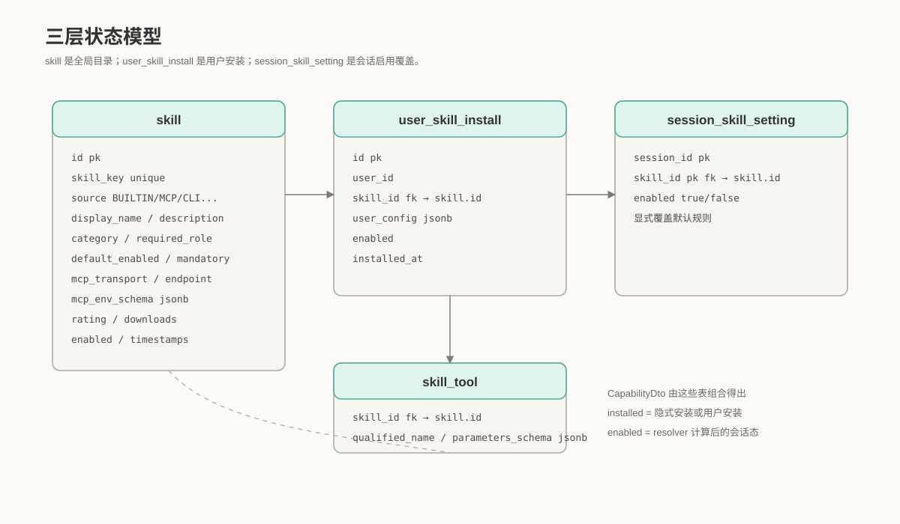
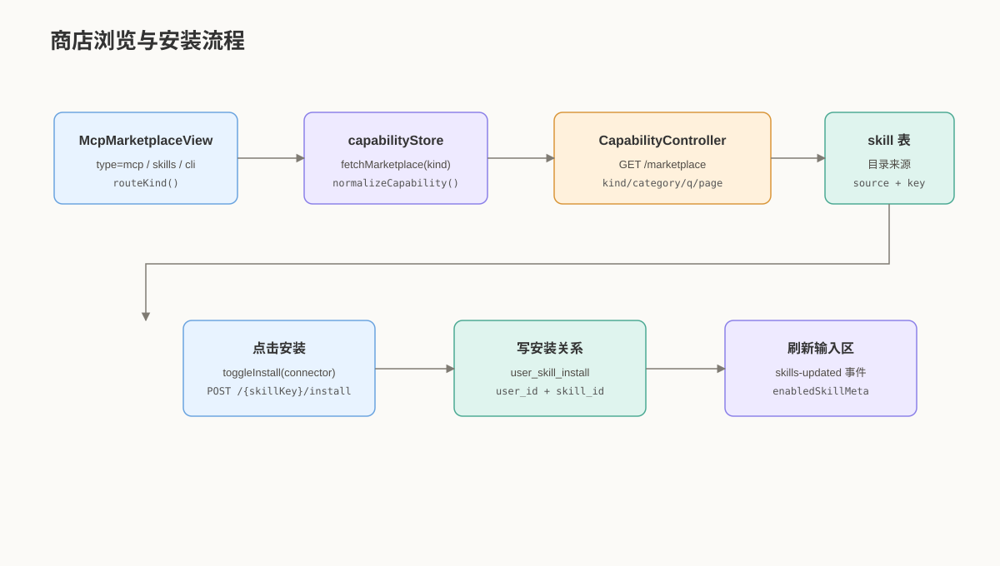
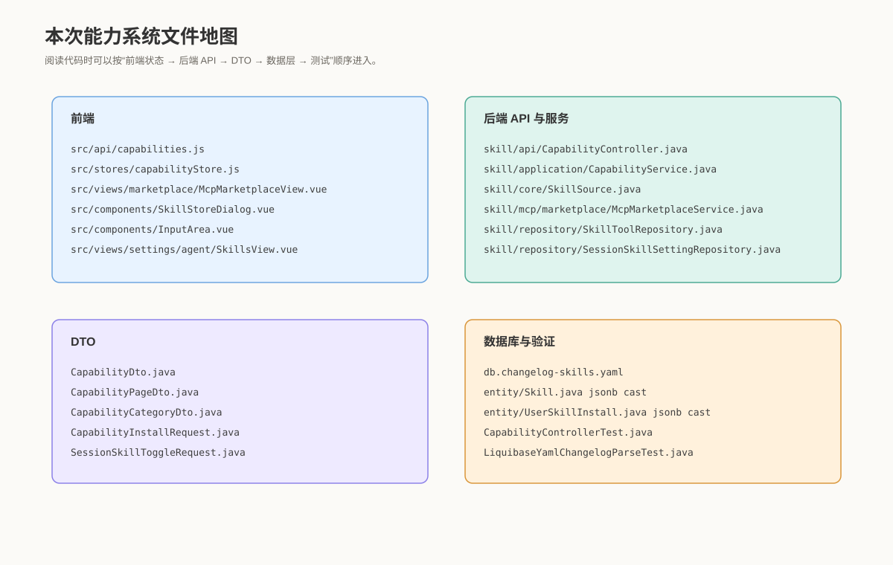
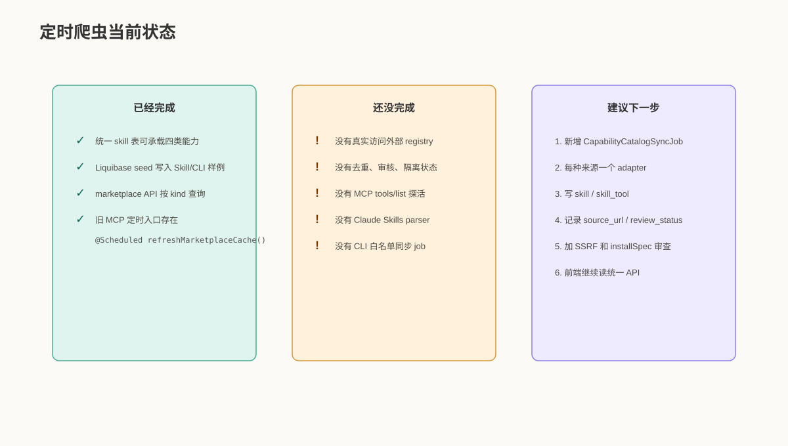
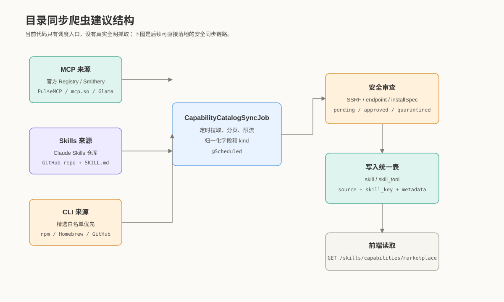
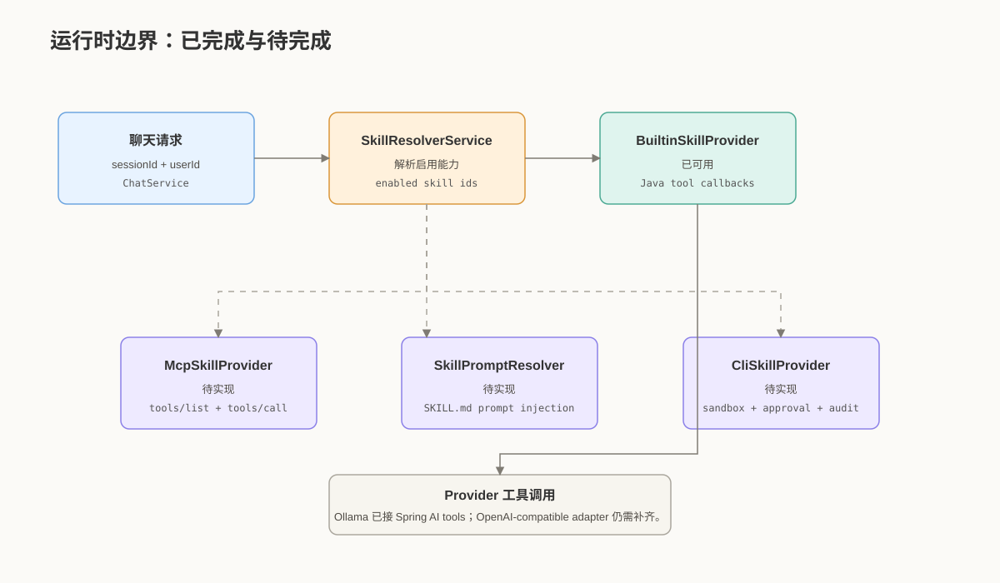

# 技能与能力系统使用说明和详细结构

> 文档版本：2026-05-29  
> 适用范围：前端 `D:\Js_UI_projects`，后端 `C:\Users\shilaoban\IdeaProjects\testDeepseekR1` 的 `skill` 领域  
> 当前落地阶段：统一目录、安装状态、会话开关、前端真实数据接入已经可用；MCP 真执行、Claude Skill prompt 注入、CLI 沙箱执行、OpenAI-compatible tool-call adapter 仍属于后续阶段。

## 1. 一句话说明

这一大块功能的目标，是把原来分散在前端本地数据、localStorage、MCP 假商店和后端旧 `skill` 表里的“技能”概念，统一成一个可持续演进的能力系统。用户在页面上看到的是四类能力：内置工具、MCP、Claude Skills、CLI。前端不再用“把 MCP 文案替换成 Skill/CLI”的方式伪造三类商店，而是通过统一 API 按 `kind` 查询真实目录。后端不新建一套平行的 `capability` 主表，而是复用已有的 `skill`、`skill_tool`、`user_skill_install`、`session_skill_setting` 和 `tool_invocation_log`。

当前已经能完整做到：商店浏览、按类型分页、安装能力、卸载能力、查看已安装能力、在单个会话中启用或关闭能力、输入区胶囊和技能弹窗同步刷新。当前还不能宣称完成的是：模型真实调用外部 MCP 工具、自动解析 Claude Skills 的 `SKILL.md` 并注入系统提示、通过沙箱执行 CLI、给 OpenAI-compatible provider 补齐 tool-call adapter。



## 2. 用户怎么使用

### 2.1 进入全屏能力商店

用户可以从设置页或输入区技能按钮进入能力商店。商店页面当前复用 `McpMarketplaceView.vue`，但是它已经不再只是 MCP 商店，而是根据路由参数决定当前展示哪一类能力：

- `#/skills/marketplace?type=mcp`：展示 MCP Server 类能力。
- `#/skills/marketplace?type=skills`：展示 Claude Skills 兼容技能。
- `#/skills/marketplace?type=cli`：展示 CLI 能力。

页面会调用：

```text
GET /api/v1/skills/capabilities/marketplace?kind=mcp|skill|cli&page=0&size=24
```

返回结果里包含 `items` 和 `categories`。`items` 是当前页能力卡片；`categories` 用来渲染左侧分类和数量。前端不需要再硬编码 Skills/CLI 的假分类。

### 2.2 安装能力

用户点击能力卡片上的安装按钮后，前端会调用：

```text
POST /api/v1/skills/capabilities/{skillKey}/install
```

例如：

```text
POST /api/v1/skills/capabilities/cli:git/install
```

后端会做两件事：

1. 确认 `skill` 表里存在这个能力目录项。
2. 在 `user_skill_install` 表里写入当前用户和该能力的安装关系。

安装不是运行。安装 `cli:git` 不等于浏览器已经能执行 Git 命令；安装 MCP 不等于已经建立 MCP 长连接。安装只是表示这个用户拥有或选择了这个能力，之后才可以在会话里启用。

### 2.3 在会话里启用或关闭能力

用户可以在输入区的技能菜单、胶囊栏、轻量技能弹窗中对当前会话开关能力。前端调用：

```text
PUT /api/v1/sessions/{sessionId}/skills/{skillKey}
Content-Type: application/json

{ "enabled": true }
```

关闭时：

```json
{ "enabled": false }
```

这个请求只影响当前会话。它不会修改其他会话，不会卸载能力，也不会修改系统默认值。后端把结果写入 `session_skill_setting`。下一次聊天请求解析工具集合时，`SkillResolverService` 会把这条会话覆盖记录纳入计算。



### 2.4 输入区胶囊栏现在展示什么

输入区下方的“为 AI 添加技能”胶囊栏只展示用户能主动理解、安装和关闭的能力，例如 MCP、Claude Skill、CLI。它不会再展示 `user_context` 这种系统身份能力，也不会用“时间”“计算器”等底座能力占用胶囊空间。

这次专门加了过滤规则：

- `user_context` 不显示在胶囊栏。
- `time` 不显示在胶囊栏。
- `math` 不显示在胶囊栏。
- `session`、`kb`、`weather`、`http_fetch`、`system_metrics`、`format` 等系统内置能力也不会作为用户技能标签展示。
- 这些系统能力如果后端 resolver 判定应该启用，仍然会在运行时生效，只是不展示成用户可删除的技能胶囊。

这能解决截图里的问题：`用户身份` 不再被当成用户主动添加的技能显示在胶囊仓。



### 2.5 轻量技能弹窗

`SkillStoreDialog.vue` 仍然承担轻量入口的角色。它会优先读取 `capabilityStore.sessionCapabilities` 或 `capabilityStore.installed`。当后端可用时，展示的是数据库状态；当后端不可用时，才退回 localStorage 缓存，避免输入区白屏。

弹窗里的开关也会优先调用后端会话开关 API。调用失败时，才使用本地缓存兜底。

### 2.6 设置页

设置页 `SkillsView.vue` 会读取安装和会话能力，展示 Skills、MCP、CLI 的数量和列表。它现在能反映数据库真实状态，而不是只读 `enabledSkills`、`enabledCliTools` 这种浏览器缓存。

## 3. 后端整体结构

后端核心选择是复用已有 `skill` 领域，而不是新建 `capability` 表。原因很直接：现有系统已经有内置工具扫描、工具定义、工具执行日志、会话级开关和 resolver。如果另建一套能力主表，就会制造两套目录、两套开关、两套运行时解析，后续更难维护。

核心表关系如下：



### 3.1 `skill`：全局能力目录

`skill` 是系统知道的所有能力目录。它承载四类能力：

- `source=BUILTIN`：内置 Java 工具。
- `source=MCP`：MCP Server。
- `source=CLAUDE_SKILL` 或 `skill_key` 前缀 `skill:`：Claude Skills 兼容技能。
- `source=CLI` 或 `skill_key` 前缀 `cli:`：CLI 能力。

重要字段：

- `skill_key`：全局唯一能力键。示例：`time`、`user_context`、`skill:data-analysis`、`cli:git`。
- `source`：能力来源枚举。决定后端如何映射 `kind`。
- `display_name`：展示名称。
- `description`：能力说明。
- `category`：分类。
- `default_enabled`：是否默认启用。
- `mandatory`：是否强制启用，强制启用能力不能被用户关闭。
- `required_role`：最低角色要求。
- `mcp_transport`、`mcp_endpoint`、`mcp_install_cmd`、`mcp_env_schema`：目前主要给 MCP 和 CLI 目录复用，后续建议拆出更明确的 metadata 字段。
- `rating`、`downloads`：商店展示热度。

### 3.2 `skill_tool`：具体可调用工具定义

一个 `skill` 可以包含多个 `skill_tool`。例如“计算器”这个内置技能下可能有数学计算工具；未来一个 MCP Server 通过 `tools/list` 发现多个工具后，也应写入 `skill_tool`。

重要字段：

- `skill_id`：所属能力。
- `tool_name`：工具短名称。
- `qualified_name`：全局唯一工具名称。
- `description`：工具说明。
- `parameters_schema`：JSON Schema。已通过 `@ColumnTransformer(write = "?::jsonb")` 修复 PostgreSQL jsonb 写入。
- `danger_level`：风险级别。
- `sort_order`：展示和注入顺序。

### 3.3 `user_skill_install`：用户安装关系

用户安装某个能力后，会写入这张表。内置 mandatory/default 能力可能没有安装记录，但仍会被视为隐式安装。

重要字段：

- `user_id`：当前用户。
- `skill_id`：能力 ID。
- `user_config`：非敏感配置，jsonb。
- `enabled`：当前安装关系是否有效。
- `installed_at`：安装时间。

注意：不要把 API Key、OAuth token、机器凭据直接写进 `user_config`。计划里有 `skill_secret`，但当前还没有落地真实加密密钥表。因此现在 `CapabilityInstallRequest.secrets` 是预留字段，不应当依赖它保存真实密钥。

### 3.4 `session_skill_setting`：会话开关覆盖

这张表保存某个会话对某个能力的显式开关。它是解决“这个会话关掉某个默认能力后，下一次聊天又被默认规则打开”的关键。

字段很少：

- `session_id`
- `skill_id`
- `enabled`

如果用户显式关闭一个默认启用能力，必须写入 `enabled=false`，否则 resolver 会回退到默认启用规则。

### 3.5 `tool_invocation_log`：工具调用审计基础

这张表已有工具调用审计字段。当前内置工具调用会写审计；未来 MCP、CLI、Skill 脚本执行也必须写这里或扩展后的审计表。

已修复 `arguments jsonb` 写入方式，避免 PostgreSQL 把普通字符串写入 jsonb 时失败。

## 4. API 说明

### 4.1 查询统一能力市场

```text
GET /api/v1/skills/capabilities/marketplace
```

查询参数：

| 参数 | 含义 |
|---|---|
| `kind` | `builtin`、`mcp`、`skill`、`cli`，为空则查询全部 |
| `category` | 分类，默认 `all` |
| `q` | 搜索关键词 |
| `sort` | `popular`、`rating`、`recent`、`tools` |
| `page` | 页码，从 0 开始 |
| `size` | 每页数量，后端最大限制 80 |
| `sessionId` | 可选，传入后返回该会话的 enabled 状态 |

响应：

```json
{
  "items": [
    {
      "skillId": 14,
      "id": "cli:git",
      "kind": "cli",
      "skillKey": "cli:git",
      "source": "CLI",
      "name": "Git CLI",
      "slug": "cli-git",
      "description": "受控读取 Git 状态、差异摘要和提交辅助信息。",
      "category": "developer",
      "installed": true,
      "enabled": true,
      "mandatory": false,
      "metadata": {
        "command": "git",
        "permissionScope": ["read", "workspace"],
        "sandboxed": true,
        "installSpec": "git"
      }
    }
  ],
  "page": 0,
  "size": 5,
  "total": 2,
  "hasMore": false,
  "categories": [
    { "key": "all", "label": "全部", "icon": "All", "count": 2 }
  ]
}
```

### 4.2 查询内置能力

```text
GET /api/v1/skills/capabilities/builtin
```

用于查看 Java 内置工具。注意：输入区胶囊会过滤掉很多 builtin，因为它们是运行时底座，不是用户主动添加的技能。

### 4.3 查询已安装能力

```text
GET /api/v1/skills/capabilities/installed
```

返回当前用户已安装能力，以及隐式安装的内置/default/mandatory 能力。

### 4.4 安装能力

```text
POST /api/v1/skills/capabilities/{skillKey}/install
Content-Type: application/json

{
  "owner": "user",
  "config": {},
  "secrets": {}
}
```

当前 `owner` 和 `secrets` 是预留字段。安装结果会返回安装后的 `CapabilityDto`。

### 4.5 卸载能力

```text
DELETE /api/v1/skills/capabilities/{skillKey}/install
```

卸载只删除当前用户安装关系，不删除全局 `skill` 目录项。mandatory 能力不能卸载。

### 4.6 查询会话能力

```text
GET /api/v1/sessions/{sessionId}/skills
```

返回当前会话可见能力及其 enabled 状态。前端输入区和弹窗应该优先使用这个接口。

### 4.7 设置会话能力开关

```text
PUT /api/v1/sessions/{sessionId}/skills/{skillKey}
Content-Type: application/json

{ "enabled": false }
```

这只影响当前会话。

## 5. 前端结构



### 5.1 `src/api/capabilities.js`

这是前端能力系统 HTTP 客户端。它统一封装：

- `fetchCapabilityMarketplace`
- `fetchBuiltinCapabilities`
- `fetchInstalledCapabilities`
- `installCapability`
- `uninstallCapability`
- `fetchSessionCapabilities`
- `setSessionCapabilityEnabled`

它会自动通过 `attachIdentityHeaders` 附带身份请求头。当前默认 API base 是：

```text
http://localhost:8080/api/v1
```

也可以通过 `VITE_AUTH_API_URL` 覆盖。

### 5.2 `src/stores/capabilityStore.js`

这是 Pinia store，承担前端能力状态中枢。它做几件事：

1. 把后端 DTO、本地 fallback、旧 localStorage 数据归一化成统一结构。
2. 按 `kind` 缓存 marketplace 数据。
3. 保存 installed 和 sessionCapabilities。
4. 调用安装、卸载、会话开关 API。
5. 写 localStorage 兼容缓存，继续触发 `skills-updated` 事件。
6. 过滤系统内置能力，避免 `user_context` 等底座能力进入胶囊展示。

关键常量：

```js
SYSTEM_CAPABILITY_KEYS = new Set([
  'time',
  'math',
  'user_context',
  'session',
  'kb',
  'weather',
  'http_fetch',
  'system_metrics',
  'format'
])
```

这些 key 代表系统内置上下文或基础工具。它们可以在后端 resolver 中生效，但不进入输入区用户技能胶囊。

### 5.3 `InputArea.vue`

输入区负责两个体验：

- 顶部/底部工具菜单里的技能与 CLI 级联菜单。
- 输入框下方的“为 AI 添加技能”胶囊栏。

现在胶囊栏只显示用户可感知能力。比如用户启用了 `cli:git`，可以显示 Git CLI；用户启用了 `skill:data-analysis`，可以显示 Data Analysis Skill；但 `user_context` 不显示。

### 5.4 `SkillStoreDialog.vue`

轻量技能弹窗优先读取 `capabilityStore`。它把 `CapabilityDto` 转换成原弹窗组件使用的 `skill` 结构，减少模板改动。开关时调用 `capabilityStore.toggleSessionSkill`。

### 5.5 `McpMarketplaceView.vue`

名字里仍然是 MCP Marketplace，但职责已经升级成全屏能力商店。它通过 route query 的 `type` 映射后端 `kind`：

- `mcp` → `mcp`
- `skills` → `skill`
- `cli` → `cli`

旧的 1000+ 假数据静态 import 已移除，避免生产 bundle 被假目录污染。现在只保留非常小的本地 fallback，后端不可用时不白屏。

### 5.6 `SkillsView.vue`

设置页读取数据库安装状态和会话状态，按 Skill、MCP、CLI 分组展示。它仍保留 localStorage fallback，但只有 API 不可用时才使用。



## 6. `CapabilityDto` 字段说明

`CapabilityDto` 是前后端之间最重要的契约。

通用字段：

| 字段 | 说明 |
|---|---|
| `skillId` | 数据库 `skill.id` |
| `id` | 前端兼容字段，当前等于 `skillKey` |
| `kind` | `builtin`、`mcp`、`skill`、`cli` |
| `skillKey` | 全局唯一能力 key |
| `source` | 后端 `SkillSource` |
| `name` | 展示名称 |
| `slug` | URL/CSS/测试友好标识 |
| `description` | 简短说明 |
| `icon` | 图标文本或 URL |
| `accent` | 前端强调色 |
| `category` | 分类 |
| `origin` | `builtin`、`community`、`official`、`custom` |
| `publisher` | 发布者 |
| `version` | 版本 |
| `rating` | 评分 |
| `downloads` | 下载量或热度 |
| `verified` | 是否验证 |
| `installed` | 当前用户是否安装或隐式安装 |
| `enabled` | 当前会话是否启用 |
| `mandatory` | 是否强制启用 |
| `defaultEnabled` | 是否默认启用 |
| `requiredRole` | 角色要求 |
| `toolNames` | 工具名摘要 |
| `metadata` | 按 kind 分支的扩展字段 |

### 6.1 builtin metadata

```json
{
  "toolNames": [],
  "toolCount": 0,
  "defaultEnabled": true
}
```

### 6.2 MCP metadata

```json
{
  "toolNames": [],
  "toolCount": 0,
  "transport": "streamable-http",
  "endpoint": "https://example.com/mcp",
  "authType": "apiKey",
  "authStatus": "none",
  "health": "unknown",
  "toolManifest": []
}
```

当前 `toolManifest` 主要来自 `skill_tool`。未来真实 connect 后，应通过 MCP `tools/list` 回填。

### 6.3 Skill metadata

```json
{
  "toolNames": [],
  "toolCount": 0,
  "frontmatter": "",
  "teaches": "指导模型完成某类工作",
  "hasScripts": false,
  "runtime": "prompt",
  "license": "MIT"
}
```

当前只是 prompt 型目录说明。未来 Claude Skill parser 会解析 `SKILL.md`、`resources/`、`scripts/`。

### 6.4 CLI metadata

```json
{
  "toolNames": [],
  "toolCount": 0,
  "command": "git",
  "permissionScope": ["read", "workspace"],
  "sandboxed": true,
  "installSpec": "git"
}
```

这只是目录和权限提示，不代表已经能执行命令。CLI 执行必须走后端沙箱、审批和审计。

## 7. 定时爬虫现在写到什么程度

你的定时爬虫目前没有完成真实“爬取全网 MCP、Skills、CLI”。后端已有旧的 `McpMarketplaceService.refreshMarketplaceCache()`：

```java
@Scheduled(cron = "${app.mcp.marketplace-sync-cron:0 17 */6 * * *}")
public void refreshMarketplaceCache() {
    lastRefreshAt = Instant.now();
}
```

它现在只更新时间戳，不会访问外部 registry，不会把全网 MCP 写入数据库，也不会解析 Claude Skills 或 CLI。它的价值是：调度开关和代码位置已经存在，后续可以改造成真实同步任务。

本次完成的是统一目录能力：只要未来爬虫把结果写入 `skill` 和 `skill_tool`，前端不需要改造，仍然读：

```text
GET /api/v1/skills/capabilities/marketplace?kind=mcp|skill|cli
```



## 8. 可以直接接入的目录来源

因为目录来源会变化，下面按“推荐优先级”和“接入方式”说明。涉及当前外部服务状态的内容需要以实际可访问文档为准；本说明给的是工程接入方案。

### 8.0 可直接使用或优先评估的链接

下面这些链接适合作为后续爬虫和目录同步的第一批来源。MCP 目录建议优先接“符合 MCP Registry API 规范”的来源；Skills 建议优先接官方 Claude Skills 文档和你信任的 Git 仓库；CLI 不建议全网自动执行，建议只把 npm/Homebrew/GitHub 作为元信息来源，再由系统白名单决定是否上架。

| 类型 | 链接 | 用途 |
|---|---|---|
| MCP 官方 Registry 说明 | https://modelcontextprotocol.io/registry/about | 了解官方 registry 定位、下游聚合器和 OpenAPI 兼容要求 |
| MCP hosted registry | https://registry.modelcontextprotocol.io | 后续可作为 MCP server 元信息同步来源 |
| PulseMCP API | https://www.pulsemcp.com/api/docs/v0.1 | PulseMCP 的 Sub-Registry API，适合拉取增强元信息 |
| Smithery Registry | https://registry.smithery.ai | Smithery MCP server registry，适合作为 MCP 来源之一 |
| Smithery 文档 | https://smithery.mintlify.dev/docs/concepts/registry_get_server | 查看单个 MCP server 信息的 registry API 文档 |
| Claude Skills 文档 | https://docs.claude.com/en/docs/claude-code/skills | 了解 `SKILL.md`、resources、scripts 的官方结构 |
| Claude Skills 中文文档 | https://docs.claude.com/zh-CN/docs/claude-code/skills | 中文版 Skill 创建和管理说明 |
| Claude Code SDK Skills | https://code.claude.com/docs/en/agent-sdk/skills | 了解 SDK 中 Skill 文件结构和限制 |
| npm Registry API | https://github.com/npm/registry/blob/main/docs/REGISTRY-API.md | CLI 目录补充来源，可用 `/-/v1/search` 搜包 |
| Homebrew Formulae API | https://formulae.brew.sh/docs/api/ | CLI 目录补充来源，可拉 formula/cask JSON |
| GitHub Search API | https://docs.github.com/en/rest/search/search | 搜索 CLI/MCP/Skill 仓库和热度信息 |

### 8.1 MCP 来源

推荐优先顺序：

1. 官方 MCP Registry 或兼容 MCP Registry 的聚合源。
2. Smithery。
3. PulseMCP。
4. mcp.so。
5. Glama MCP directory。
6. GitHub topic/search，作为补充来源。

MCP 同步需要字段：

- 名称。
- 描述。
- 作者或发布组织。
- repo URL。
- endpoint 或 install command。
- transport 类型。
- authType。
- 分类。
- tags。
- stars、downloads、评分或热度。
- 最近更新时间。

安全要求：

- 禁止自动上架 localhost、内网 IP、metadata IP endpoint。
- 不自动执行 `stdio` 安装命令。
- 不把 registry 返回的 install command 直接拼 shell。
- 远程 endpoint 要做 SSRF 检查。
- 工具 schema 要限制大小。

### 8.2 Claude Skills 来源

Claude Skills 的理想来源不是传统 marketplace，而是 Git 仓库或目录结构。同步器需要识别：

```text
skill-name/
  SKILL.md
  resources/
  scripts/
```

解析重点：

- `SKILL.md` frontmatter。
- 技能标题。
- 技能说明。
- 适用场景。
- 是否包含 scripts。
- scripts 使用语言。
- resources 文件数量和类型。
- 许可证。
- repo URL。

当前后端已经新增 `SkillSource.CLAUDE_SKILL`，并 seed 了两条样例：

- `skill:document-writer`
- `skill:data-analysis`

但还没有真实 parser，也没有 prompt 注入。

### 8.3 CLI 来源

CLI 不建议一开始做“全网自由爬取后自动可执行”。更安全的顺序是：

1. 维护系统白名单：`git`、`npm`、`pnpm`、`node`、`gh`、`docker` 等。
2. 从 npm registry、Homebrew formula、GitHub repo 补充元信息。
3. 每个 CLI 只开放结构化 action，例如 `git_status`、`git_diff_summary`、`npm_test`。
4. 禁止默认暴露万能 `run_command`。

当前已 seed：

- `cli:git`
- `cli:npm`

这两条能在商店展示、安装、会话启用，但不会真实执行命令。



## 9. 建议的真实爬虫落地方案

建议新增一组后端组件：

```text
skill/catalog/
  CapabilityCatalogSyncJob.java
  CapabilitySourceAdapter.java
  McpRegistryAdapter.java
  ClaudeSkillGitHubAdapter.java
  CliCatalogAdapter.java
  CapabilityCatalogNormalizer.java
  CapabilitySecurityReviewer.java
  CapabilityUpsertService.java
```

### 9.1 `CapabilitySourceAdapter`

定义所有来源的统一接口：

```java
public interface CapabilitySourceAdapter {
    String sourceName();
    List<RawCapabilityItem> fetchPage(int page, int size);
}
```

每个 adapter 只负责拉取原始数据，不直接写库。

### 9.2 `CapabilityCatalogNormalizer`

把不同来源归一成内部结构：

```java
NormalizedCapability {
  kind,
  skillKey,
  source,
  displayName,
  description,
  category,
  author,
  repoUrl,
  documentationUrl,
  rating,
  downloads,
  metadata
}
```

### 9.3 `CapabilitySecurityReviewer`

安全审查必须在写入公开市场前做：

- endpoint SSRF 检查。
- installSpec 检查。
- repo URL 检查。
- tool schema 大小检查。
- 是否包含高风险脚本。
- 是否重复。
- 是否来源可信。

审查结果建议写入后续扩展字段：

- `review_status`
- `security_score`
- `source_url`
- `last_synced_at`
- `metadata`

### 9.4 `CapabilityUpsertService`

统一写入：

- `skill`
- `skill_tool`
- 后续 `capability_source`
- 后续 `mcp_runtime`

不要让每个 adapter 自己写库，否则字段映射会散落在不同来源里。

## 10. 当前运行时边界



当前可用运行时：

- 内置工具链路继续复用已有 `SkillResolverService`、`BuiltinSkillProvider`、`ToolExecutorService`。
- 本地 Ollama 分支已经能走 Spring AI tools。

当前未完成运行时：

- MCP 安装后不能真实 `tools/list`。
- MCP 启用后不能真实 `tools/call`。
- Claude Skill 启用后不会自动把 `SKILL.md` 注入系统提示。
- Claude Skill scripts 不会执行。
- CLI 启用后不会执行宿主命令。
- OpenAI-compatible 分支还没有 tool-call adapter。

因此用户界面上应避免写“已可执行全网 MCP/CLI”。更准确的文案是：

- “已安装”
- “已启用到本会话”
- “目录已同步”
- “运行时待接入”
- “当前仅内置工具支持真实调用”

## 11. 为什么浏览器不能直接调用 CLI 操作电脑

浏览器前端不能直接执行 CLI，也不能通过 WebSocket 透明转发 shell。这是安全边界。

正确链路应该是：

```text
前端点击或模型请求
→ 后端结构化 tool request
→ AccessPolicyEvaluator 判断权限
→ 高风险动作生成审批
→ 用户批准
→ CLI sandbox 执行 argv
→ 写 tool_invocation_log
→ 返回脱敏结果
```

默认不应该允许：

- `rm -rf`
- 写用户 home。
- 访问内网地址。
- 安装未知二进制。
- `curl | sh`。
- `sudo`。
- 任意 shell 拼接。

## 12. 开发者阅读顺序

建议按下面顺序看代码：

1. `src/api/capabilities.js`：先看前端怎么调用 API。
2. `src/stores/capabilityStore.js`：再看前端如何归一化状态、写缓存、过滤系统能力。
3. `InputArea.vue`：看胶囊栏和会话开关。
4. `McpMarketplaceView.vue`：看全屏市场如何按 kind 拉数据。
5. `CapabilityController.java`：看后端 API 入口。
6. `CapabilityService.java`：看安装、卸载、会话开关、DTO 映射。
7. `CapabilityDto.java`：看字段契约。
8. `db.changelog-skills.yaml`：看 seed 数据。
9. `CapabilityControllerTest.java`：看接口测试。

## 13. 已验证内容

本次功能验证覆盖：

- 后端编译通过。
- 后端完整测试通过。
- 新增能力 Controller 测试通过。
- 前端测试通过。
- 前端 build 通过。
- 真实 HTTP 调用验证：
  - MCP 市场能查到数据。
  - Skill 市场能查到 `skill:data-analysis`、`skill:document-writer`。
  - CLI 市场能查到 `cli:git`、`cli:npm`。
  - 安装 `cli:git` 成功。
  - 当前会话关闭 `cli:git` 返回 `enabled=false`。
  - 当前会话重新开启 `cli:git` 返回 `enabled=true`。
- 浏览器打开 CLI 商店能正常渲染后端目录。
- 生产 bundle 不再包含 1000+ 本地 MCP 假数据。
- 输入区胶囊过滤规则已加，系统能力不会显示成用户技能标签。

## 14. 后续最重要的任务

### 14.1 接真实目录同步

优先实现 `CapabilityCatalogSyncJob`，写入 `skill` 表。前端已经准备好，不需要再改商店接口。

### 14.2 接 MCP runtime

需要新增：

- `McpSkillProvider`
- MCP client
- connect/disconnect
- health/tools API
- `tools/list` 写 `skill_tool`
- `tools/call` 代理
- secret 加密存储
- SSRF 防护

### 14.3 接 Claude Skill parser

需要新增：

- `ClaudeSkillManifestParser`
- `SkillPromptResolver`
- resources 预算控制
- scripts 风险扫描
- scripts 走 CLI sandbox

### 14.4 接 CLI sandbox

需要新增：

- CLI 白名单。
- 结构化 CLI tools。
- 权限策略。
- 审批流。
- 沙箱执行器。
- stdout/stderr 脱敏。
- 审计日志。

### 14.5 补 OpenAI-compatible tool-call adapter

现在本地 Ollama 已走 Spring AI tool callbacks，但 OpenAI-compatible 自研 HTTP 客户端还没有工具调用适配。要补：

- tool schema 转换。
- tool_call 解析。
- 工具执行。
- 多轮回灌。
- provider 不支持工具时明确返回能力限制。

## 15. 当前结论

这次改动已经把“看起来像技能商店”的前端状态，变成了可由后端数据库支撑的统一能力状态。用户可以浏览不同 kind 的能力，可以安装，可以在会话里启用或关闭，刷新后状态仍由后端恢复。输入区也不再把“用户身份”这类系统底座能力展示成可删除技能。

但定时全网爬虫还没有真正完成；当前只有旧 MCP service 的定时入口和新的统一目录承载能力。下一步如果要做“全网 MCP、Skills、CLI 自动同步”，应该直接写入 `skill` 和 `skill_tool`，前端继续读统一 capability API。运行时方面，当前真实可执行的仍主要是内置工具；MCP、Claude Skills、CLI 的真实执行链路需要按后续阶段继续补齐。
